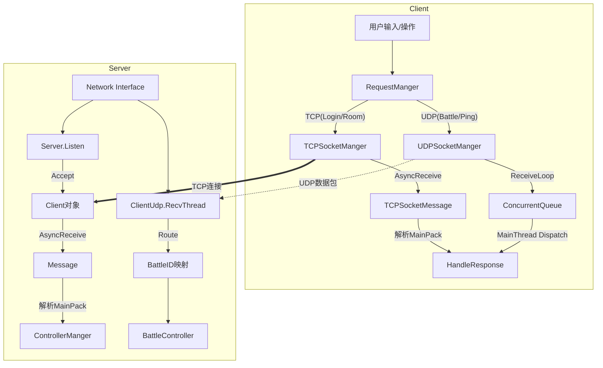

# 核心网络通信模块全景技术文档

## 1. 整体架构与数据流向

### 1.1 主循环/处理管道流转图

本项目的网络层采用 **TCP (大厅/状态) + UDP (战斗/同步)** 双通道架构。

### 1.2 核心设计理念
- **双通道分离**：可靠性业务走 TCP，实时性业务走 UDP。
- **协议统一**：所有通信均使用 `SocketProto.MainPack`（Google Protobuf）。
- **TCP 粘包处理**：使用 Length-Prefixed 格式（长度头+包体）解决流式传输问题。
- **UDP 跨线程安全**：接收线程只负责入队，主线程负责逻辑分发（无锁队列）。

---

## 2. 核心模块关系图

### 2.1 模块功能概览
1.  **Transport Layer (传输层)**：负责 Socket 的物理连接、异步收发、缓冲区管理。
2.  **Protocol Layer (协议层)**：负责字节流与 `MainPack` 对象的相互转换（序列化/反序列化）。
3.  **Routing Layer (路由层)**：负责将解析后的 `MainPack` 分发给具体的业务控制器。
4.  **Session Layer (会话层)**：管理连接生命周期、心跳、断线重连。

### 2.2 脚本依赖关系矩阵

| 模块 | 核心脚本 (Server) | 核心脚本 (Client) | 作用 |
| :--- | :--- | :--- | :--- |
| **基础工具** | `Tool/Message.cs` `SocketProto.cs` `Tool/IPManager.cs` | `TCPSocketMessage.cs` `SocketProto.cs` | 协议定义、粘包处理、IP获取 |
| **TCP 通信** | `Server/Server.cs` `Server/Client.cs` | `TCPSocketManger.cs` | TCP 连接管理、异步收发循环 |
| **UDP 通信** | `Server/ClientUdp.cs (LZJUDP)` | `UDPSocketManger.cs` | UDP 接收线程、路由映射 |
| **路由分发** | `Controller/ControllerManger.cs` `Controller/Controllers.cs` | `RequestManger.cs` | 消息分发、反射调用 |

---

## 3. 模块内聚合脚本索引 (全覆盖)

### 3.1 服务端 (Server)
*   **Tool/**
    *   `Message.cs`: TCP 消息缓冲区与粘包处理核心。
    *   `IPManager.cs`: 获取本机 IP 地址。
*   **Server/**
    *   `Server.cs`: TCP 监听入口，管理 `Client` 列表，处理心跳。
    *   `Client.cs`: 代表一个在线玩家，持有 Socket 和数据库连接，处理异步收发。
    *   `ClientUdp.cs`: UDP 单例，负责接收所有 UDP 包并路由到战斗控制器。
*   **Controller/**
    *   `ControllerManger.cs`: 消息分发器，反射调用具体 Controller。
    *   `Controllers.cs`: 包含所有具体业务逻辑 (User/Friend/Room/Battle)。
*   **Protocol/**
    *   `SocketProto.cs`: Protobuf 协议定义 (自动生成)。

### 3.2 客户端 (Client)
*   **Server/**
    *   `TCPSocketMessage.cs`: 对应服务端的 `Message.cs`，客户端版粘包处理。
    *   `SocketProto.cs`: 共用的协议文件。
*   **Server/Manger/**
    *   `TCPSocketManger.cs`: TCP 连接管理，异步接收循环。
    *   `UDPSocketManger.cs`: UDP 连接管理，跨线程队列。
    *   `RequestManger.cs`: 客户端的消息分发中心。

---

## 4. 典型业务流程全路径

### 4.1 流程一：TCP 登录 (Login)
**路径**：客户端输入账号密码 -> 服务端校验 -> 返回结果

1.  **输入 (Client)**: 用户点击登录按钮 -> `RequestManger.Login(user, pwd)`。
2.  **封装 (Client)**: 构造 `MainPack` (Request=User, Action=Login)，调用 `TCPSocketManger.Send()`。
3.  **发送 (Client)**: `TCPSocketMessage.PackData` 加长度头 -> `NetworkStream.Write`。
4.  **接收 (Server)**: `Client.ReceiveCallBack` 收到数据 -> `Message.ReadBuffer` 解析粘包 -> 还原 `MainPack`。
5.  **分发 (Server)**: `Client.HandleRequest` -> `Server.HandleRequest` -> `ControllerManger.HandleRequest`。
6.  **业务 (Server)**: 反射调用 `UserController.Login` -> `UserData.Login` 查数据库 -> 返回 `MainPack`。
7.  **回传 (Server)**: `Client.Send` -> `writeQueue` 入队 -> `Socket.BeginSend`。
8.  **响应 (Client)**: `TCPSocketManger` 收到包 -> `RequestManger.HandleResponse` -> UI 更新。

### 4.2 流程二：UDP 战斗移动 (Move)
**路径**：玩家摇杆 -> 服务端广播 -> 所有客户端同步

1.  **输入 (Client)**: `BattleManger` 采集摇杆 -> `CommandManger` 生成 `PlayerOperation`。
2.  **发送 (Client)**: `UDPSocketManger.SendOperation` -> 构造 `MainPack` (Action=BattlePushDowmPlayerOpeartions)。
3.  **路由 (Server)**: `ClientUdp.RecvThread` 收到 UDP 包 -> `TryResolveBattleID` 根据 IP:Port 找到 `BattleID`。
4.  **处理 (Server)**: `BattleController.Handle` -> `UpdatePlayerOperation` -> 写入 `Input Buffer`。
5.  **广播 (Server)**: `BattleLoop` 帧循环 -> `CollectAndBroadcast` -> `ClientUdp.Send` 广播给所有人。
6.  **同步 (Client)**: `UDPSocketManger` 接收 -> `DrainAndDispatch` 主线程处理 -> `BattleManger` 执行帧同步。

---

## 5. 核心脚本/类注释表

| 脚本名 | 作用 | 关键交互对象 |
| :--- | :--- | :--- |
| **Message.cs** | **TCP 拼包器**。维护字节数组缓冲区，解决 TCP 粘包/半包问题。 | 被 `Client.cs` 持有 |
| **Client.cs** | **玩家会话对象**。代表一个 TCP 连接，持有 `UserData` (数据库数据) 和 `Message` (缓冲区)。 | 被 `Server.cs` 管理列表 |
| **Server.cs** | **TCP 总管**。监听端口，Accept 新连接，管理在线列表，心跳检测。 | 持有 `ControllerManger` |
| **ControllerManger.cs** | **路由分发器**。解析 `MainPack` 的 Request/Action Code，反射调用具体方法。 | 被 `Server.cs` 调用 |
| **ClientUdp.cs** | **UDP 总管**。单线程接收所有 UDP 包，维护 IP:Port 到 BattleID 的映射表。 | 调用 `BattleController` |
| **TCPSocketManger.cs** | **客户端 TCP 管理**。负责连接服务端、断线重连、消息回调注册。 | 调用 `RequestManger` |
| **UDPSocketManger.cs** | **客户端 UDP 管理**。负责战斗数据收发，使用并发队列实现线程安全。 | 被 `BattleManger` 调用 |

---

## 6. 单个脚本重要变量与函数拆解

### 6.1 Server/Tool/Message.cs (TCP 核心)

*   **变量 `byte[] buffer`**: 1024 字节缓冲区，用于暂存 Socket 收到的数据。
*   **变量 `int startindex`**: 游标，指向缓冲区中有效数据的末尾。
*   **函数 `ReadBuffer(int len, Action<MainPack> callback)`**:
    *   **作用**: 解析接收到的 `len` 字节数据。
    *   **逻辑**: 循环检查 `startindex` 是否满足包头长度 -> 读包体长度 -> 切割包体 -> 反序列化 -> 移位剩余数据。这是解决粘包的关键。

### 6.2 Server/Server/Client.cs (会话核心)

*   **变量 `Socket _socket`**: 持有与客户端的底层 TCP 连接。
*   **变量 `Queue<ByteArray> writeQueue`**: 发送队列，防止多线程并发发送导致的数据错乱。
*   **函数 `ReceiveCallBack(IAsyncResult iar)`**:
    *   **作用**: 异步接收回调。
    *   **逻辑**: `EndReceive` 获取长度 -> `Message.ReadBuffer` 解析 -> 再次 `BeginReceive` 保持监听。
*   **函数 `Send(MainPack pack)`**:
    *   **作用**: 发送数据。
    *   **逻辑**: `Message.PackData` 封包 -> 加锁入队 -> 若队列为空则触发 `BeginSend`。

### 6.3 Server/Controller/ControllerManger.cs (路由核心)

*   **变量 `Dictionary<RequestCode, BaseControllers> _controllerDic`**: 路由表，映射 RequestCode 到具体 Controller 实例。
*   **函数 `HandleRequest(MainPack pack, Client client)`**:
    *   **作用**: 消息分发。
    *   **逻辑**: 查表找 Controller -> `pack.ActionCode.ToString()` 获取方法名 -> `Type.GetMethod` 反射获取 MethodInfo -> `Invoke` 执行。
